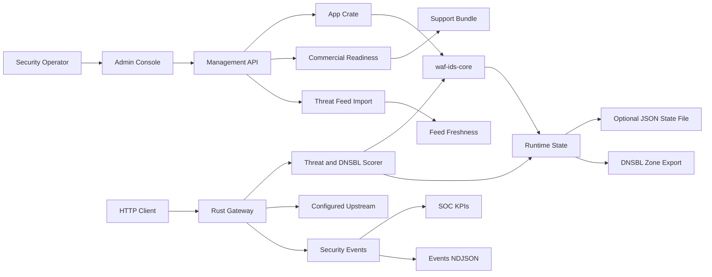

# Architecture

## Current Baseline

## Components

- `src/main.rs`: process startup and operator configuration from `BIND_ADDR`, `ADMIN_TOKEN`, `WAF_IDS_STATE_PATH`, `DNSBL_ORIGIN`, and `EVENT_LIMIT`.
- `src/lib.rs`: Axum app, routing, management APIs, optional JSON persistence, gateway handler, upstream proxying, admin console, support bundle assembly, NDJSON event export, and in-crate HTTP tests.
- `crates/waf-ids-core`: reusable domain models plus validation, upsert, scoring, DNSBL zone export, event retention, threat-feed freshness, KPI snapshot, and commercial readiness logic.
- `/admin`: embedded web console.
- `/gateway/{path}`: route selection, request scoring, monitor/block decision, optional upstream proxying.
- `/dnsbl/zone`: DNSBL zone text using the configured origin, suitable for publication through an authoritative DNS server.
- `/api/commercial/license`: tenant/license metadata for commercial packaging.
- `/api/commercial/readiness`: computed 2B KRW sale-readiness checks and blockers.
- `/api/threat-feeds/import`: authorized threat indicator and DNSBL import surface.
- `/api/threat-feeds/freshness`: feed TTL expiry and stale/fresh evidence for buyer and SOC review.
- `/api/support-bundle`: health, KPI, license, readiness, and evidence-count bundle for buyer or support review.
- `/api/events.ndjson`: security events as newline-delimited JSON for lightweight SOC/SIEM ingestion tests.
- `scripts/smoke.sh`: external smoke test for health, admin, auth, route writes, license writes, feed imports, block enforcement, KPIs, readiness, DNSBL export, support bundle, and restart persistence.

## Near-Term Integrations

- **WAF**: Coraza/OWASP CRS adapter should produce anomaly scores and matched rule metadata. The gateway should consume those scores instead of replacing CRS.
- **IDS**: Suricata EVE JSON ingest should create `SecurityEvent` records and correlate them with gateway route/client context.
- **Threat Intelligence**: STIX/TAXII, MISP, and OpenCTI importers should update `ThreatIndicator` and `DnsblEntry` records with source, TTL, and confidence.
- **DNSBL Serving**: Hickory DNS should serve authoritative DNSBL responses directly after zone export semantics stabilize.
- **AI SOC**: AI triage should summarize events, map likely ATT&CK tactics, and recommend actions. Enforcement-changing recommendations require human approval.

## Security Boundaries

- Default bind address is localhost.
- Remote management requires `ADMIN_TOKEN` plus external TLS and identity controls.
- `WAF_IDS_STATE_PATH` enables JSON state persistence for standalone operation. Without it, the service uses seeded in-memory state.
- File-backed writes use temporary sibling files followed by atomic rename. Management API mutations roll back in memory if the state file cannot be replaced.
- Block mode is route-scoped to avoid global accidental enforcement.
- JSON persistence is a baseline durability mechanism, not a substitute for a production database, backup plan, or audited change workflow.
- Commercial readiness is a runtime evidence model for buyer pilots, not a legal revenue recognition or compliance certification system.
- The reusable core remains in-repo as a workspace crate. A git submodule is intentionally deferred until an independently versioned engine, SDK, or adapter needs a separate release lifecycle.

## Product Architecture Evidence

- FigJam: `docs/figma/enterprise-product-architecture.md`
- Product workflows: `docs/product-design/enterprise-operator-workflows.md`
- Enterprise scorecard: `docs/analytics/enterprise-value-scorecard.md`
- Complexity audit: `docs/ponytail/2026-07-02-complexity-audit.md`
