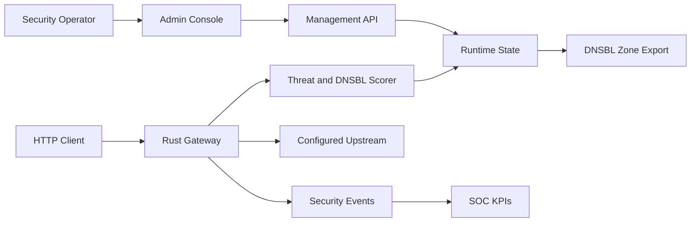

# Architecture

## Current MVP

## Components

- `src/main.rs`: process startup, bind address, optional admin token.
- `src/lib.rs`: Axum app, management APIs, gateway handler, scoring, DNSBL zone export, and unit tests.
- `/admin`: embedded web console.
- `/gateway/{path}`: route selection, request scoring, monitor/block decision, optional upstream proxying.
- `/dnsbl/zone`: DNSBL zone text suitable for publication through an authoritative DNS server.

## Near-Term Integrations

- **WAF**: Coraza/OWASP CRS adapter should produce anomaly scores and matched rule metadata. The gateway should consume those scores instead of replacing CRS.
- **IDS**: Suricata EVE JSON ingest should create `SecurityEvent` records and correlate them with gateway route/client context.
- **Threat Intelligence**: STIX/TAXII, MISP, and OpenCTI importers should update `ThreatIndicator` and `DnsblEntry` records with source, TTL, and confidence.
- **DNSBL Serving**: Hickory DNS should serve authoritative DNSBL responses directly after zone export semantics stabilize.
- **AI SOC**: AI triage should summarize events, map likely ATT&CK tactics, and recommend actions. Enforcement-changing recommendations require human approval.

## Security Boundaries

- Default bind address is localhost.
- Remote management requires `ADMIN_TOKEN` plus external TLS and identity controls.
- The MVP stores runtime state in memory only. Durable storage should be added before production use.
- Block mode is route-scoped to avoid global accidental enforcement.
