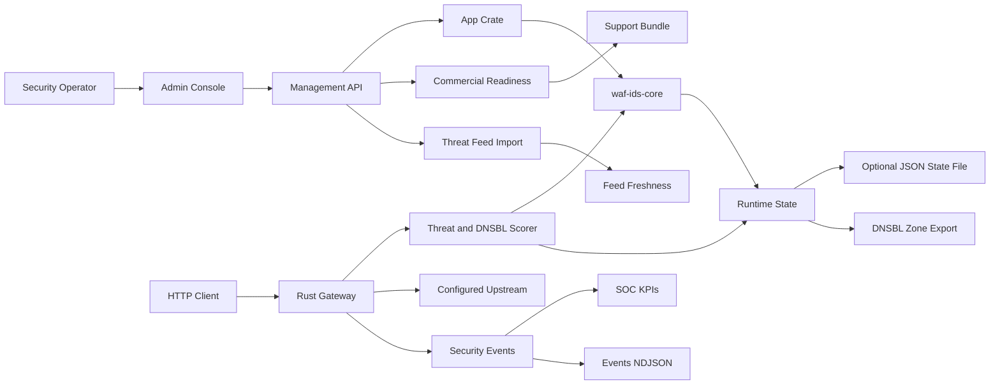

# Architecture

## Current Baseline

```mermaid
flowchart LR
  operator["Security Operator"] --> admin["Admin Console"]
  admin --> api["Management API"]
  api --> app["App Crate"]
  app --> core["waf-ids-core"]
  core --> state["Runtime State"]
  state --> file["Optional JSON State File"]
  client["HTTP Client"] --> gateway["Rust Gateway"]
  gateway --> scorer["Threat and DNSBL Scorer"]
  scorer --> core
  scorer --> state
  gateway --> upstream["Configured Upstream"]
  gateway --> events["Security Events"]
  events --> kpis["SOC KPIs"]
  events --> eventExport["Events NDJSON"]
  state --> zone["DNSBL Zone Export"]
  api --> commercial["Commercial Readiness"]
  api --> feeds["Threat Feed Import"]
  feeds --> freshness["Feed Freshness"]
  commercial --> bundle["Support Bundle"]
```

## Components

- `src/main.rs`: process startup and operator configuration from `BIND_ADDR`, `ADMIN_TOKEN`, `WAF_IDS_STATE_PATH`, `DNSBL_ORIGIN`, and `EVENT_LIMIT`.
- `src/lib.rs`: Axum app, routing, management APIs, optional JSON persistence, gateway handler, upstream proxying, admin console, support bundle assembly, NDJSON event export, and in-crate HTTP tests. Persistence, destination-list, and sidecar settings validate before the readiness line is printed.
- `src/control_plane.rs`: PostgreSQL production authority (issue #80). Non-loopback binds require `CONTROL_PLANE_DATABASE_URL`. Tenant isolation is default-deny RLS. `sslmode=require` uses rustls. The JSON file adapter remains loopback/community only.
- `src/outbox.rs`: transactional outbox + leased workers (issue #81). Security events append incrementally with an outbox row in the same transaction. Workers claim with `SKIP LOCKED`. `GET /api/outbox` is bounded to `EVENT_LIMIT` (processed rows pruned; receipts kept). `/healthz.outbox` is operator-visible.
- `src/destination.rs`: fail-closed outbound URL policy (issue #79) for every `http`/`https` send. CIDR allowlist exceptions are per resolved address; blocking DNS is offloaded from Tokio workers. The outbound HTTP client DNS resolver returns only addresses that already passed policy (TCP peer pin / DNS-rebinding TOCTOU close).
- `crates/waf-ids-core`: reusable domain models plus validation, upsert, scoring, DNSBL zone export, event retention, threat-feed freshness, KPI snapshot, and commercial readiness logic.
- `/admin`: embedded web console.
- `/gateway/{path}`: route selection, request scoring, monitor/block decision, optional upstream proxying.
- `/dnsbl/zone`: DNSBL zone text using the configured origin, suitable for publication through an authoritative DNS server.
- `/api/commercial/license`: tenant/license metadata for commercial packaging.
- `/api/commercial/readiness`: computed 2B KRW sale-readiness checks and blockers.
- `/api/threat-feeds/import`: authorized threat indicator and DNSBL import surface.
- `/api/threat-feeds/freshness`: feed TTL expiry and stale/fresh evidence for buyer and SOC review.
- `/api/support-bundle`: health, KPI, license, readiness, and evidence-count bundle for buyer or support review.
- `/api/events.ndjson`: security events as newline-delimited JSON for lightweight SOC/SIEM ingestion tests.
- `scripts/smoke.sh`: external smoke test for health, admin, auth, route writes, license writes, feed imports, block enforcement, KPIs, readiness, DNSBL export, support bundle, and restart persistence.

## Near-Term Integrations

- **WAF**: Coraza/OWASP CRS audit JSON/NDJSON ingest is available at `POST /api/waf/coraza/audit` (admin token). Interrupted transactions and CRS rule messages become `SecurityEvent` rows and feed gateway enforcement (DNSBL + `client_ip`/`path` threat indicators) so subsequent gateway decisions block matching clients. When `CORAZA_LIB_PATH` is set, each live `/gateway` transaction is evaluated in-process through the libcoraza C ABI (operator-supplied library + CRS file/directives). Otherwise, when `CORAZA_WAF_URL` is set, the transaction is POSTed to that sidecar and the response is parsed with the same Coraza audit adapter — CRS authority stays in Coraza; Wardnet does not invent WAF rules. `GET /api/waf/engine-status` reports `coraza_in_process`, `coraza_sidecar`, or `ingest_hints_only`. Suricata tail/shipper and detection-quality corpora remain follow-ups.
- **IDS**: Suricata EVE JSON/NDJSON ingest is available at `POST /api/ids/suricata/eve` (admin token). Alert records become `SecurityEvent` rows for SOC export/KPI; full route correlation and live EVE tailing remain follow-ups.
- **Threat Intelligence**: STIX 2.x indicator/bundle ingest is available at `POST /api/threat-intel/stix` (admin token), MISP Event/attribute JSON ingest at `POST /api/threat-intel/misp` (admin token), TAXII 2.1 collection poll at `POST /api/threat-intel/taxii/poll` (admin token; Basic/Bearer optional), and OpenCTI observable/indicator export ingest at `POST /api/threat-intel/opencti` (admin token). All update `ThreatIndicator` / `DnsblEntry` plus feed freshness. Live MISP REST pull and live OpenCTI GraphQL pull remain follow-ups.
- **DNSBL Serving**: Hickory DNS should serve authoritative DNSBL responses directly after zone export semantics stabilize.
- **AI SOC**: AI triage should summarize events, map likely ATT&CK tactics, and recommend actions. Enforcement-changing recommendations require human approval.

## Security Boundaries

- Default bind address is localhost.
- Remote management requires `ADMIN_TOKEN` plus external TLS and identity controls.
- `WAF_IDS_STATE_PATH` enables JSON state persistence for standalone/loopback operation. Without it, the service uses seeded in-memory state. Production binds require PostgreSQL (`CONTROL_PLANE_DATABASE_URL`).
- File-backed writes use temporary sibling files followed by atomic rename. Management API mutations roll back in memory if the state file cannot be replaced.
- Block mode is route-scoped to avoid global accidental enforcement.
- JSON persistence is a baseline durability mechanism, not a substitute for a production database, backup plan, or audited change workflow.
- Commercial readiness is a runtime evidence model for buyer pilots, not a legal revenue recognition or compliance certification system.
- The reusable core remains in-repo as a workspace crate. A git submodule is intentionally deferred until an independently versioned engine, SDK, or adapter needs a separate release lifecycle.

## Product Architecture Evidence

- FigJam: `docs/figma/enterprise-product-architecture.md`
- Product workflows: `docs/product-design/enterprise-operator-workflows.md`
- Enterprise scorecard: `docs/analytics/enterprise-value-scorecard.md`
- Complexity audit: `docs/ponytail/2026-07-02-complexity-audit.md`
