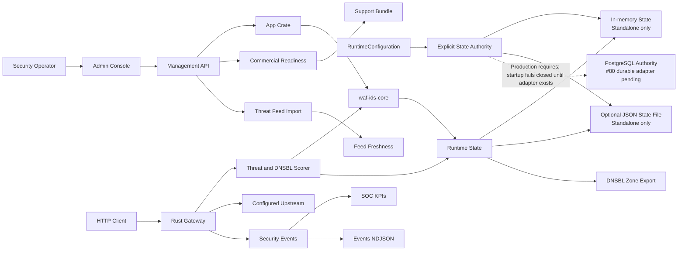

# Architecture

## Current Baseline

```mermaid
flowchart LR
  operator["Security Operator"] --> admin["Admin Console"]
  admin --> api["Management API"]
  api --> app["App Crate"]
  app --> core["waf-ids-core"]
  core --> state["Runtime State"]
  state --> memory["In-memory State\nStandalone only"]
  state --> file["Optional JSON State File\nStandalone only"]
  runtime["RuntimeConfiguration"] --> authority["Explicit State Authority"]
  authority --> memory
  authority --> file
  authority -. "Production requires; startup fails closed until adapter exists" .-> postgres["PostgreSQL Authority\n#80 durable adapter pending"]
  client["HTTP Client"] --> gateway["Rust Gateway"]
  gateway --> scorer["Threat and DNSBL Scorer"]
  scorer --> core
  scorer --> state
  gateway --> upstream["Configured Upstream"]
  gateway --> events["Security Events"]
  events --> kpis["SOC KPIs"]
  events --> eventExport["Events NDJSON"]
  state --> zone["DNSBL Zone Export"]
  api --> commercial["Commercial Readiness"]
  api --> feeds["Threat Feed Import"]
  feeds --> freshness["Feed Freshness"]
  commercial --> bundle["Support Bundle"]
```

## Components

- `src/runtime_config.rs`: runtime-configuration supporting subdomain bootstrap. Reads non-secret process settings from env once, validates them into an immutable `RuntimeConfiguration`, and passes that snapshot inward to `run_from_env`. Deployment intent and state authority are explicit: standalone may use memory or file state, while production requires an explicit PostgreSQL authority declaration. Until #80 wires the durable PostgreSQL adapter, selecting it fails before listener startup rather than downgrading to memory/file persistence.
- `src/credentials.rs`: secret bootstrap adapter. Reads `ADMIN_TOKEN`, `ADMIN_TOKENS`, and optional `WAF_IDS_CREDENTIALS_PATH` only at the process edge, then exposes a process-local `CredentialRegistry`.
- `src/main.rs`: thin process entrypoint and shutdown-signal installation.
- `src/lib.rs`: Axum app, routing, management APIs, standalone JSON persistence, gateway handler, upstream proxying, admin console, support bundle assembly, NDJSON event export, and in-crate HTTP tests.
- `crates/waf-ids-core`: reusable domain models plus validation, upsert, scoring, DNSBL zone export, event retention, threat-feed freshness, KPI snapshot, and commercial readiness logic.
- `/admin`: embedded web console.
- `/gateway/{path}`: route selection, request scoring, monitor/block decision, optional upstream proxying.
- `/dnsbl/zone`: DNSBL zone text using the configured origin, suitable for publication through an authoritative DNS server.
- `/api/commercial/license`: tenant/license metadata for commercial packaging.
- `/api/commercial/readiness`: computed 2B KRW sale-readiness checks and blockers.
- `/api/threat-feeds/import`: authorized threat indicator and DNSBL import surface.
- `/api/threat-feeds/freshness`: feed TTL expiry and stale/fresh evidence for buyer and SOC review.
- `/api/support-bundle`: health, KPI, license, readiness, and evidence-count bundle for buyer or support review.
- `/api/events.ndjson`: security events as newline-delimited JSON for lightweight SOC/SIEM ingestion tests.
- `scripts/smoke.sh`: external smoke test for health, admin, auth, route writes, license writes, feed imports, block enforcement, KPIs, readiness, DNSBL export, support bundle, and restart persistence.

## Near-Term Integrations

- **WAF**: Coraza/OWASP CRS audit JSON/NDJSON ingest is available at `POST /api/waf/coraza/audit` (admin token). Interrupted transactions and CRS rule messages become `SecurityEvent` rows and feed gateway enforcement (DNSBL + `client_ip`/`path` threat indicators) so subsequent gateway decisions block matching clients. In-process Coraza embedding remains a follow-up — do not replace CRS with hand-rolled rules.
- **IDS**: Suricata EVE JSON/NDJSON ingest is available at `POST /api/ids/suricata/eve` (admin token). Alert records become `SecurityEvent` rows for SOC export/KPI; full route correlation and live EVE tailing remain follow-ups.
- **Threat Intelligence**: STIX 2.x indicator/bundle ingest is available at `POST /api/threat-intel/stix` (admin token), MISP Event/attribute JSON ingest at `POST /api/threat-intel/misp` (admin token), TAXII 2.1 collection poll at `POST /api/threat-intel/taxii/poll` (admin token; Basic/Bearer optional), OpenCTI observable/indicator export ingest at `POST /api/threat-intel/opencti` (admin token), and a CISA Known Exploited Vulnerabilities (KEV) catalog pull at `POST /api/threat-intel/cisa-kev` (admin token; fetches the official catalog and upserts one `cve` threat indicator per entry, severity escalated when CISA has tied the CVE to a known ransomware campaign). All update `ThreatIndicator` / `DnsblEntry` plus feed freshness. Live MISP REST pull and live OpenCTI GraphQL pull remain follow-ups.
- **DNSBL Serving**: Hickory DNS should serve authoritative DNSBL responses directly after zone export semantics stabilize.
- **AI SOC**: AI triage should summarize events, map likely ATT&CK tactics, and recommend actions. Enforcement-changing recommendations require human approval.

### Further reading (runtime bootstrap authority separation)

- Saltzer, J. H., & Schroeder, M. D. (1975). The protection of information in
  computer systems. *Proceedings of the IEEE, 63*(9), 1278-1308.
  https://doi.org/10.1109/PROC.1975.9939 - least privilege and fail-safe
  defaults support keeping secret bootstrap in `CredentialRegistry`, making
  deployment/state authority explicit, and rejecting unavailable production
  authority instead of silently falling back to a weaker state backend.
- Souppaya, M., Scarfone, K., & Dodson, D. (2022). *Secure Software Development
  Framework (SSDF) version 1.1: Recommendations for mitigating the risk of
  software vulnerabilities* (NIST Special Publication 800-218). National
  Institute of Standards and Technology. https://doi.org/10.6028/NIST.SP.800-218.
  SP 800-218 version 1.1 remains the current final SSDF; NIST published SP
  800-218 Rev. 1 / SSDF 1.2 as an Initial Public Draft in December 2025, so the
  draft informs future review but is not represented here as final normative
  authority.
- Barker, E. (2020). *Recommendation for key management: Part 1-General* (NIST
  Special Publication 800-57 Part 1 Rev. 5). National Institute of Standards
  and Technology. https://doi.org/10.6028/NIST.SP.800-57pt1r5 -
  [`papers/nist-sp-800-57-part-1-rev-5.pdf`](papers/nist-sp-800-57-part-1-rev-5.pdf).
  The protected-storage, access-control, replacement, and recovery lifecycle
  maps to Wardnet's split between secret bootstrap inputs and non-secret
  listener, DNSBL, retention, deployment, and state-authority settings.
- Krause, A., Klemmer, J. H., Huaman, N., Wermke, D., Acar, Y., & Fahl, S.
  (2023). Pushed by accident: A mixed-methods study on strategies of handling
  secret information in source code repositories. In *32nd USENIX Security
  Symposium (USENIX Security 23)* (pp. 2527-2544).
  https://www.usenix.org/conference/usenixsecurity23/presentation/krause -
  operational evidence that repository-visible secrets remain a recurring
  failure mode, which is why Wardnet keeps credential-file selection and admin
  tokens out of `RuntimeConfiguration`.

### Further reading (CISA KEV catalog pull)

- CISA. (2021). *Binding Operational Directive 22-01: Reducing the Significant Risk of Known Exploited Vulnerabilities.* Cybersecurity and Infrastructure Security Agency. https://www.cisa.gov/known-exploited-vulnerabilities — the directive establishing the catalog's confirmed-active-exploitation inclusion criterion, which is why `kev_import.rs` treats catalog membership alone as at least `High` severity rather than deriving it from a numeric score.
- Jacobs, J., Romanosky, S., Edwards, B., Adjerid, I., & Roytman, M. (2021). Exploit Prediction Scoring System (EPSS). *Digital Threats: Research and Practice, 2*(3), Article 20. https://doi.org/10.1145/3436242 — the seminal data-driven framework establishing that confirmed/predicted exploitation likelihood is a stronger remediation-priority signal than static CVSS severity, motivating exploitation-evidence-first indicators like KEV over severity-only scoring.
- Shimizu, N., & Hashimoto, M. (2025). Vulnerability Management Chaining: An Integrated Framework for Efficient Cybersecurity Risk Prioritization. *arXiv:2506.01220* — [`papers/vulnerability-management-chaining-kev-epss-cvss-arxiv-2506.01220.pdf`](papers/vulnerability-management-chaining-kev-epss-cvss-arxiv-2506.01220.pdf) (CC BY 4.0). Demonstrates that KEV-membership-first filtering ahead of CVSS materially reduces urgent-remediation workload versus severity-only triage, and that KEV alone still misses exploited vulnerabilities EPSS catches — supporting this adapter's role as one input among several proven feeds (STIX/MISP/TAXII/OpenCTI), not a replacement for them.

## Security Boundaries

- Default bind address is localhost. Production intent is never inferred from this address because a production process may legitimately listen on loopback behind a proxy or sidecar.
- Remote management requires `ADMIN_TOKEN` plus external TLS and identity controls.
- Runtime configuration is loaded once at bootstrap and handed inward as an immutable snapshot; application code does not read operational env vars directly.
- Standalone mode may use seeded in-memory state or JSON state selected by `WAF_IDS_STATE_PATH`. File-backed writes use temporary sibling files followed by atomic rename, and management API mutations roll back in memory if the state file cannot be replaced.
- Production mode requires `WARDNET_STATE_AUTHORITY=postgres`. The current selector deliberately rejects startup because the #80 durable PostgreSQL repository/RLS/migration adapter has not landed; this fail-closed prerequisite is not a claim that PostgreSQL persistence is already implemented.
- Block mode is route-scoped to avoid global accidental enforcement.
- JSON persistence is a standalone baseline durability mechanism, not a substitute for the production database, tenant-isolation policy, backup/restore plan, or audited change workflow required by #80/#192.
- Commercial readiness is a runtime evidence model for buyer pilots, not a legal revenue recognition or compliance certification system.
- The reusable core remains in-repo as a workspace crate. A git submodule is intentionally deferred until an independently versioned engine, SDK, or adapter needs a separate release lifecycle.

## Product Architecture Evidence

- FigJam: `docs/figma/enterprise-product-architecture.md`
- Product workflows: `docs/product-design/enterprise-operator-workflows.md`
- Enterprise scorecard: `docs/analytics/enterprise-value-scorecard.md`
- Complexity audit: `docs/ponytail/2026-07-02-complexity-audit.md`
