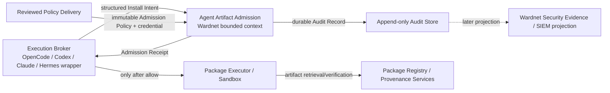

# Agent Artifact Admission bounded context

Status: active design contract for PR #129.

Wardnet treats pre-execution package admission as a distinct bounded context rather than another route inside the gateway monolith. The context protects one decision: whether an execution broker may proceed with one exact package-install intent. It does not execute packages, resolve registries, infer publisher ownership from documents, or own the execution sandbox.

## Subdomain classification

- **Core subdomain — Security Admission:** deterministic allow/block decisions at Wardnet-controlled trust boundaries. Gateway traffic admission and agent artifact admission share security policy principles, but they do not share mutable domain state or persistence.
- **Supporting subdomain — Security Evidence:** durable, minimized decision evidence used for incident response and later SIEM projection.
- **Supporting subdomain — Policy Delivery:** reviewed immutable policy and credential material supplied to a process instance.
- **Generic subdomain — HTTP/process hosting:** Axum routing, loopback listener lifecycle, file-backed configuration, and operating-system signal handling.

## Ubiquitous language

**Install Intent** is the structured request presented before a package manager runs. **Admission Policy** is reviewed immutable policy for one process revision. **Approved Manifest** identifies one reviewed workspace dependency manifest by workspace and SHA-256. **Approved Artifact** identifies one exact artifact by ecosystem, name, version, registry, owner, digest, and the argv token that names it. **Admission Decision** is the deterministic allow/block domain result. **Admission Receipt** is the response representation of that decision. **Audit Record** is minimized durable evidence written before an authenticated admission response is returned. **Instruction Source** records where the install suggestion came from without granting that source authority. **Execution Broker** is an external caller that must require an allow receipt before invoking a package manager.

The terms `service`, `manager`, `helper`, `common`, `shared`, and `model` are not bounded-context concepts and must not become new responsibility containers. The domain vocabulary now lives in `admission.rs`; new domain concepts should continue to use names from this glossary rather than a generic catch-all module.

## Context map

### Upstream and downstream contracts

The execution broker is an upstream customer of this context. Its agent text, retrieved pages, issue comments, and tool output are untrusted data. The broker may not bypass the admission result or translate a block into an allow.

Policy delivery is an upstream published configuration contract. The admission context consumes reviewed policy; it does not mutate policy at runtime. Future signed bundles may replace local files behind an Anti-Corruption Layer without changing the domain types.

Package registries, Sigstore/TUF/SLSA evidence, and sandbox execution are downstream or external authorities. Their provider-specific schemas must not enter the admission domain as entities. Future integrations translate them through adapters into exact artifact/provenance facts.

Wardnet SIEM/OCSF/OTLP export is a downstream evidence context. Agent Artifact Admission owns the decision and its canonical audit fact; SIEM export owns external event projections. Projection formats must not become domain dependencies.

## Aggregate and invariants

The v0.1 decision is intentionally stateless. `AdmissionPolicy` is immutable process state, while each `InstallIntent` is evaluated independently and produces one `AdmissionDecision`. No long-lived aggregate graph is required.

The transaction boundary for an authenticated admission request is: evaluate the intent, build the audit fact, durably append it, then return the receipt. An allow must never be visible before durable audit succeeds. Audit failure changes the externally visible result to fail-closed service unavailability. Policy and credentials are not mutated in that transaction.

## Dependency direction

`admission.rs` and `policy.rs` form the domain kernel and must remain independent of Axum, Tokio, filesystem, listener, and deployment concerns. `audit.rs` defines the evidence contract and its current local-file adapter; this mixed file is acceptable only while the adapter remains small and the domain never depends on its concrete sink. If additional audit backends arrive, move concrete sinks behind an adapter module before adding them. `config.rs` and `http.rs` are adapter/delivery concerns and may depend inward on domain contracts. `main.rs` is composition only.

`crates/agent-artifact-admission/tests/ddd_architecture_contract.rs` is the first architectural fitness gate for this context. Extend it whenever a new provider, persistence backend, or delivery surface is introduced.

## Anti-corruption boundaries

- Provider-specific registry metadata, package-manager output, Sigstore bundles, TUF metadata, and SLSA attestations are external models. Translate them into reviewed artifact/provenance facts before they influence admission.
- OpenCode/Codex/Claude/Hermes agent messages are not domain commands. The execution broker must construct the strict `InstallIntent` contract explicitly.
- SIEM/OCSF/OTLP schemas are projections of canonical audit facts, not canonical admission entities.

## Split triggers

Keep this bounded context as one independently deployable crate while its transactionality and deployment lifecycle remain cohesive. Split only when a stable responsibility acquires an independent policy lifecycle, persistence authority, release cadence, or reuse boundary. A new protocol adapter alone is not a reason to create a service.
