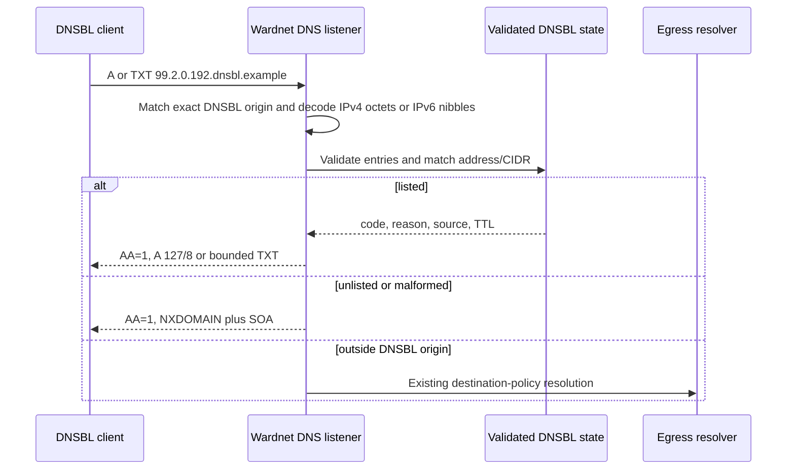

# Authoritative DNSBL serving

## Decision

Wardnet's existing bounded UDP/TCP DNS listener answers IPv4 and IPv6 DNSBL queries
inside `DNSBL_ORIGIN` before entering recursive egress resolution. A query name
uses RFC 5782 reversed-octet form for IPv4, for example
`99.2.0.192.dnsbl.example`, or RFC 3596's 32 reversed hexadecimal nibbles for
IPv6. Listed addresses receive authoritative A and TXT
records; unlisted, malformed, and zone-apex names receive authoritative
`NXDOMAIN` with an RFC 2308 SOA for negative caching and are never forwarded
upstream. Listed names queried for unsupported types return the same SOA with
empty `NOERROR` (NODATA).

The implementation reuses the live `AppState` DNSBL entries,
`waf_ids_core::dnsbl_matches`, persisted-entry validation, per-entry TTLs, and
the existing 64-request UDP/TCP concurrency bounds. It adds no daemon or
dependency. CIDR entries are evaluated at query time, so every address in a
listed range receives the required record without materializing an entire zone.

## Security and operability

- The origin comparison is label-boundary exact; suffix lookalikes do not enter
  the authoritative path.
- Persisted rows are revalidated before publication. Invalid response codes,
  empty provenance, invalid prefixes, and zero TTLs cannot become DNS answers.
- TXT character strings are bounded to DNS's 255-octet wire limit on a UTF-8
  boundary.
- DNSBL answers set the authoritative bit and do not advertise recursion.
- Unsupported types for a listed name return authoritative empty `NOERROR`;
  both NODATA and NXDOMAIN include the zone SOA for bounded negative caching.
  Non-DNSBL names retain the existing A/AAAA resolver contract.
- IPv6 names require exactly 32 single hexadecimal labels. Compressed or
  malformed representations fail authoritatively instead of entering recursive
  resolution.

## Verification

`src/egress_dns.rs` tests cover A/TXT content, CIDR membership, TTL propagation,
IPv4 octet and IPv6 nibble decoding, authoritative `NXDOMAIN`/NODATA SOA
records, malformed names, and real loopback
UDP/TCP exchanges through the production server loop. Repository readiness still requires
protected-branch checks and deployed port-53 evidence.

## References

Levine, J. (2010). *DNS blacklists and whitelists* (RFC 5782). Internet
Research Task Force. https://doi.org/10.17487/RFC5782

Thomson, S., Huitema, C., Ksinant, V., & Souissi, M. (2003). *DNS extensions
to support IP version 6* (RFC 3596). Internet Engineering Task Force.
https://doi.org/10.17487/RFC3596

Vixie, P., Andrews, M., Lindqvist, M., & Wassenaar, E. (1998). *Negative
caching of DNS queries (DNS NCACHE)* (RFC 2308). Internet Engineering Task
Force. https://doi.org/10.17487/RFC2308
