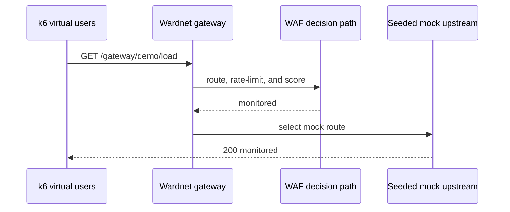

# Gateway k6 load evidence

## Contract

`scripts/k6-gateway.sh` starts the real Rust server on an isolated loopback
port and runs `tests/load/gateway.js` against the seeded monitored ingress
route. The check fails on any HTTP error or response that did not traverse the
expected route. k6 reports request rate and latency percentiles without turning
an unapproved latency target into a release claim.

The default closed-model scenario holds 32 concurrent virtual users for 30
seconds. Operators can set `K6_VUS` and `K6_DURATION` to reproduce a
deployment-specific concurrency profile. This does not establish saturation
capacity: that requires an arrival-rate profile and an agreed latency objective
against the deployed data plane.



## Run

```bash
scripts/k6-gateway.sh
K6_VUS=64 K6_DURATION=60s scripts/k6-gateway.sh
K6_CLOSE_CONNECTIONS=true scripts/k6-gateway.sh
```

The default reuses HTTP connections, matching HTTP/1.1's usual behavior.
`K6_CLOSE_CONNECTIONS=true` opens a new connection for every request so accept
and connection teardown costs can be measured separately. The harness uses
in-memory state and a seeded mock upstream, so it measures the asynchronous
gateway decision path rather than proxy I/O or local state-file durability.
PostgreSQL and real-upstream profiles remain separate deployment acceptance
tests.

## Local evidence — 2026-08-27T03:42+09:00

On the local macOS 26.5.1 arm64 development host, k6 2.2.0 produced the
following 15-second comparison against the same exact binary and monitored
mock route:

| State | Users | Requests/s | p95 | Failed requests |
| --- | ---: | ---: | ---: | ---: |
| Before removing no-op in-memory state clones | 32 | 607.12 | 154.06 ms | 0 / 9,156 |
| Before removing no-op in-memory state clones | 64 | 378.73 | 432.36 ms | 0 / 5,810 |
| After removing no-op in-memory state clones | 32 | 3,902.28 | 19.00 ms | 0 / 58,576 |
| After removing no-op in-memory state clones | 64 | 2,925.91 | 77.28 ms | 0 / 43,934 |

The bottleneck was full `AppData` rollback and persistence-snapshot cloning on
every request even when neither a state file nor PostgreSQL existed. Wardnet
now skips that impossible rollback work only in memory mode. Durable adapters
retain serialization, snapshots, and rollback. The remaining throughput drop
between 32 and 64 users should be profiled against the deployed persistence and
upstream path before setting a service-level objective.

Dean and Barroso (2013) show why the scenario records p95 under concurrent
load: as utilization and system scale increase, uncommon slow responses can
dominate end-to-end service latency. That evidence supports measuring the tail;
it does not establish a Wardnet latency target, which remains deployment-specific.

Aron et al. (1999) ground the closed-model request distribution choice here:
the benchmark keeps concurrency fixed while the gateway makes route-selection
and admission decisions, which is useful for isolating how the current service
degrades as active clients rise even though it is not, by itself, a saturation
or capacity-planning claim.

## References

Dean, J., & Barroso, L. A. (2013). The tail at scale. *Communications of the
ACM, 56*(2), 74–80. https://doi.org/10.1145/2408776.2408794

- Design impact: Wardnet records tail latency under concurrent load instead of
  only mean throughput because slow outliers dominate operator-visible service
  quality long before aggregate request rate looks unhealthy.

Aron, M., Sanders, D., Druschel, P., & Zwaenepoel, W. (1999). *Scalable
content-aware request distribution in cluster-based network servers*. USENIX
Annual Technical Conference.
https://www.usenix.org/legacy/event/usenix99/full_papers/aron/aron.pdf

- Design impact: the default harness uses a closed model with a fixed number of
  active clients because that exposes how the current gateway decision path
  behaves as concurrency rises, without overstating the result as full
  saturation or admission-capacity evidence.

Grafana Labs. (n.d.). *Grafana k6 documentation*. Retrieved August 27, 2026,
from https://grafana.com/docs/k6/latest/
