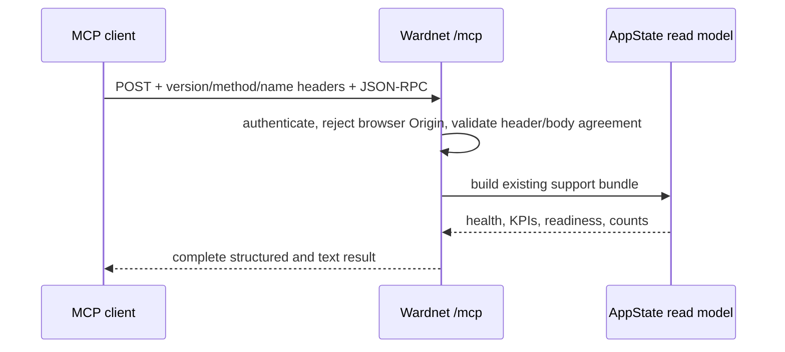

# Stateless MCP operations surface

Decision date: 2026-08-27

## Decision and product contract

Wardnet exposes one authenticated `POST /mcp` endpoint using the stable Model
Context Protocol revision `2026-07-28`. It is stateless: clients may call
`server/discover`, `tools/list`, `tools/call`, or `ping` on any instance without
an initialization handshake, sticky session, or shared MCP session store.

The first tool is `wardnet_status`. It reuses the existing support-bundle read
model to return live gateway health, SOC KPIs, readiness, threat-feed freshness,
and inventory counts as both `structuredContent` and backward-compatible text.
It is read-only, idempotent, non-destructive, and closed-world. Mutation tools
are deliberately absent until Keyverse identity, tenant authorization, consent,
and human approval evidence close issue #82.

## Transport, security, and operability

- `X-Admin-Token` uses Wardnet's existing credential-registry-backed operator
  boundary; read-only RBAC tokens may call the read-only tool.
- Every browser request carrying `Origin` fails with 403. Browser MCP is not in
  this slice; rejecting it avoids trusting an attacker-controlled `Host` during
  DNS rebinding. Native/agent clients do not send `Origin`.
- `Accept` must advertise both `application/json` and `text/event-stream`.
- `MCP-Protocol-Version`, `Mcp-Method`, and, for `tools/call`, `Mcp-Name` must
  match the JSON-RPC body. Invalid or unsupported protocol metadata fails with
  HTTP 400 before tool execution.
- `tools/list` and `server/discover` use a five-minute private cache hint. The
  catalog is deterministic and tenant credentials must never share cached data.
- Axum supplies 405 for unsupported GET/DELETE methods. No SSE stream, task,
  resource, prompt, sampling, roots, logging, or mutating tool exists in this
  slice; add one only when an operator workflow and acceptance evidence require
  it.

Protected delivery requires exact-head Rust, security, review-thread, and
independent-approval gates. Local tests or a stacked PR do not prove that the
endpoint is available on protected `main`. Runtime acceptance additionally
requires an authenticated client to perform discovery, list the tool, call it,
and compare the structured result with `/api/support-bundle` on the same
deployment. `tests/load/mcp.js` is the repeatable k6 contract; concurrency and
duration are command-line test conditions, while pass/fail is limited to HTTP
and response-contract correctness rather than an invented latency target.

Local runtime evidence on 2026-08-27 used the real debug binary on
`127.0.0.1:3017` with 10 concurrent k6 virtual users for 10 seconds. All 4,992
authenticated `wardnet_status` calls passed (0 HTTP failures, 495.9 requests/s,
19.55 ms mean, 107.79 ms p95, 449.23 ms maximum). This is focused loopback
capacity evidence, not a production SLO or protected-main deployment proof.

## APA 7th references

Model Context Protocol Core Maintainers. (2026, July 28). *The 2026-07-28
specification*. https://blog.modelcontextprotocol.io/posts/2026-07-28/

Model Context Protocol. (2026). *Model Context Protocol specification:
2026-07-28*. Retrieved August 27, 2026, from
https://modelcontextprotocol.io/specification/2026-07-28

Model Context Protocol. (2026). *Transports*. Retrieved August 27, 2026, from
https://modelcontextprotocol.io/specification/2026-07-28/basic/transports
