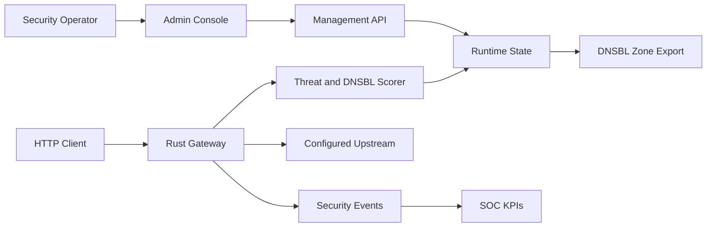

# Figma Diagram Brief

## Diagram Set

1. **System Architecture**: operator, admin console, management API, runtime state, gateway, scorer, upstream, events, KPIs, DNSBL export.
2. **Gateway Request Flow**: request, route selection, DNSBL/threat scoring, block/monitor decision, upstream proxy, event write.
3. **Threat Intel Pipeline**: STIX/TAXII, MISP, OpenCTI, feed normalizer, TTL/confidence policy, indicator store, DNSBL publisher.
4. **AI SOC Approval Flow**: event cluster, AI summary, analyst review, approved policy change, audit event.

## Generated Artifact

The first generated FigJam artifact is the System Architecture diagram:

https://www.figma.com/board/WDSTrDb1fsGOcV8BOYSC5a?utm_source=codex&utm_content=edit_in_figjam&oai_id=&request_id=14acead2-d2ae-4f91-b548-de09866e4d32&architecture=true

Additional diagrams should be placed in the same FigJam file when iterating.

## Mermaid Source

