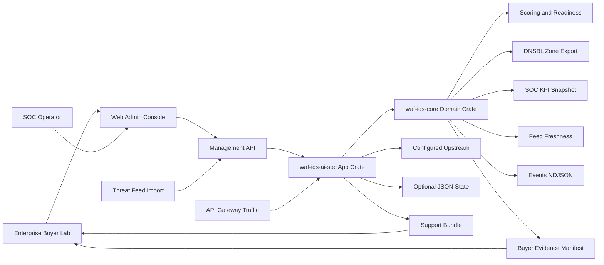

# Enterprise Product Architecture FigJam

## Artifact

- FigJam: https://www.figma.com/board/JExziD87eUWKLERECUGhWQ?utm_source=codex&utm_content=edit_in_figjam&oai_id=&request_id=a97d2861-82f8-4d43-9d16-27e07b13b10c&architecture=true
- Title: WAF IDS AI SOC 2B KRW Product Architecture
- Added section: `Freshness and SOC Export Evidence`
- Added diagram: `Buyer Evidence Manifest Runtime Map`
- Figma Code Connect: not used

## Source Architecture

## Design Notes

- The visible product should read as an operator console first.
- Architecture proof should emphasize the Rust memory-safety boundary and small reusable core.
- Buyer evidence should connect directly to APIs, docs, deployment assets, tests, and support bundle output.
- Feed freshness and SOC event export should be visible as buyer-verifiable runtime evidence, not only roadmap text.
- The buyer evidence manifest should make the runtime endpoints, document paths, and deployment assets reviewable without requiring buyers to assemble the checklist manually.
- Future engine integrations should be presented as adapters, not as hidden hand-rolled WAF/IDS logic.
