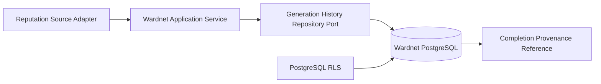
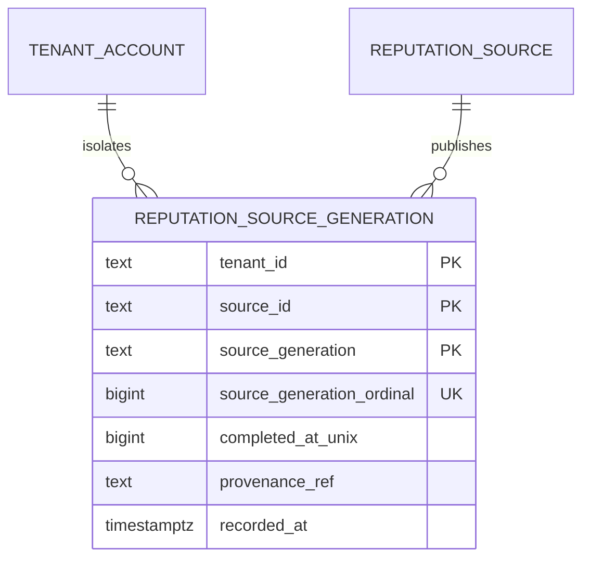

# Wardnet product and technical gap baseline

**Evidence date:** 2026-09-08  
**Authority:** protected source plus exact PR and hosted execution evidence  
**Current change:** PR #199, Proposed / Draft

## Product requirement

A security operator must be able to ingest successive reputation-source
generations without one tenant observing, overwriting, or replaying another
tenant's history. A failed or missing tenant binding must stop the transaction;
it must never fall back to shared or file-backed state.

## Technical requirement

The first PostgreSQL slice stores immutable generation identity and completion
provenance. It requires:

- tenant-scoped uniqueness for both source generation tokens and ordinals;
- nonblank tenant, source, generation, and provenance identities;
- transaction-local tenant context with no connection-reuse leakage;
- PostgreSQL `ENABLE ROW LEVEL SECURITY` and `FORCE ROW LEVEL SECURITY`;
- no runtime owner, superuser, or `BYPASSRLS` privilege;
- no update/delete policy for immutable history.

Production `StateAuthority::Postgres` remains fail closed until the repository
port, transaction boundary, pooling, migration runner, backup/restore, and
operability evidence are separately integrated.

## Context Map



The adapter supplies source truth. Wardnet owns admission and history. PostgreSQL
owns transactional persistence and tenant policy enforcement. A provenance
reference points to evidence; it does not copy foreign evidence or credentials
into the aggregate.

## ERD



## Application sequence

```mermaid
sequenceDiagram
  participant A as Source Adapter
  participant S as Wardnet Application Service
  participant D as PostgreSQL
  A->>S: submit exact generation and provenance reference
  S->>D: BEGIN; SET LOCAL wardnet.tenant_id
  S->>D: INSERT immutable generation
  alt tenant mismatch or replay
    D-->>S: RLS or uniqueness failure
    S-->>A: fail closed
  else accepted
    D-->>S: committed generation identity
    S-->>A: accepted receipt
  end
```

## Exact-head acceptance matrix

| Capability | Evidence | Status |
|---|---|---|
| Missing migration produces deterministic RED | PR #199 run 34225504005, job 102058512687 | RED reproduced |
| Tenant-scoped token and ordinal uniqueness | `tests/postgres_generation_rls.rs` | Proposed |
| Missing/cross-tenant context fails closed | Same integration contract | Proposed |
| Transaction-local context clears after commit | Same integration contract | Proposed |
| Immutable update/delete boundary | Migration exposes no UPDATE/DELETE RLS policy | Proposed; add executable mutation cases before adapter enablement |
| Repository port and item UPSERT | Not implemented in this slice | Gap |
| Pooling, backup/restore, migration rollback, observability | No protected evidence | Gap |
| Production authority enablement | Explicitly rejected by current startup guard | Blocked by design |

## Actions

1. Run the real PostgreSQL 18.4 integration contract on the unchanged #199 head.
2. Add explicit attempted UPDATE and DELETE regressions before connecting the
   application repository port.
3. Implement the smallest repository port and transaction boundary without
   cross-service SQL or shared database access.
4. Prove pooling context reset, backup/restore, migration rollback, locks, and
   operational telemetry before enabling production PostgreSQL authority.
